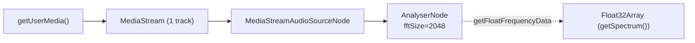
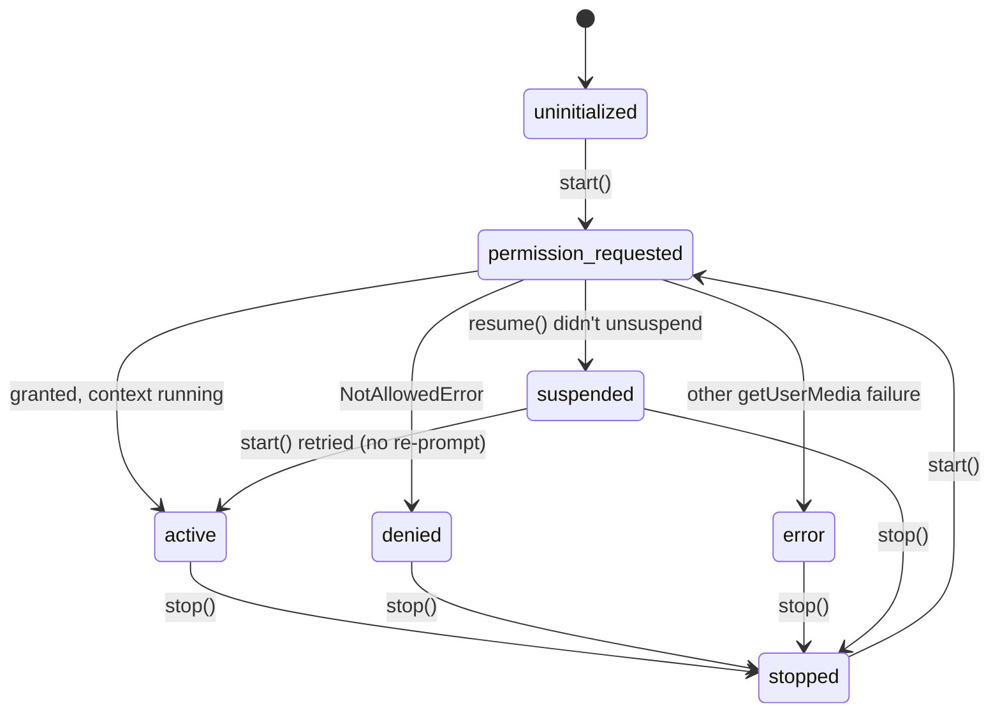

# Audio capture

Reference doc for `src/audio/index.ts`, the only module in `src/`
allowed to touch the Web Audio API. For why its `getUserMedia`
constraints look the way they do, see
[ADR 0002](./adr/0002-agc-off-raw-constraints.md).

## API

| Member | Type | Notes |
|---|---|---|
| `new MicrophoneCapture(options?)` | constructor | Touches no browser API. Safe to call before any user gesture. |
| `.state` | `AudioCaptureState` (getter) | See state diagram below. |
| `.info` | `MicrophoneCaptureInfo \| null` (getter) | Set once `start()` resolves; `null` otherwise. |
| `.start()` | `Promise<MicrophoneCaptureInfo>` | Must run inside a user-gesture handler (click, tap). Requests permission, builds the audio graph, resumes the context. Throws on double-call while active. |
| `.stop()` | `Promise<void>` | Idempotent — safe to call when never started or already stopped. Stops tracks, disconnects nodes, closes the context. |
| `.getSpectrum()` | `Float32Array` | Same buffer reused every call — don't retain it across frames. Throws unless `state === "active"`. |

`MicrophoneCaptureInfo.deviceId` comes from
`MediaStreamTrack.getSettings()`, not the constraint that was
requested — the browser may have selected a different device than the
one asked for. `sampleRate` comes from `audioContext.sampleRate`, so
`src/dsp/` never needs to touch `AudioContext` to convert a bin index
to Hz.

### Errors

All extend `MicrophoneCaptureError`. None are swallowed — every
failure path throws or rejects.

| Class | Cause |
|---|---|
| `MicrophonePermissionDeniedError` | `NotAllowedError` / legacy `PermissionDeniedError` |
| `MicrophoneNotFoundError` | `NotFoundError` / legacy `DevicesNotFoundError` |
| `MicrophoneHardwareError` | `NotReadableError` / legacy `TrackStartError` — mic busy or hardware fault |
| `MicrophoneConstraintsUnsupportedError` | `OverconstrainedError` — platform can't disable AEC/ANS/AGC |
| `AudioContextSuspendedError` | `resume()` didn't bring the context to `"running"` |
| `MicrophoneCaptureStateError` | Misuse: e.g. `getSpectrum()` before `start()` |

## Audio graph

The analyser never connects to `audioContext.destination` — doing so
would route the microphone to the speakers and create a feedback loop.

## State machine

`denied` and `error` are also reachable to `active`/`permission_requested`
on retry — `start()` from any non-`active`/non-`permission-requested`
state re-requests permission from scratch, except `suspended`, which
resumes the existing context without re-prompting.

## Known gaps

- **No automated tests.** `getUserMedia` and `AudioContext` cannot run
  headlessly — there is no microphone in Node/CI, and jsdom implements
  neither Web Audio nor `MediaDevices`. Unlike `src/dsp/`, which will
  get golden-file tests, this module is verified manually (see the
  implementation plan's verification steps, or exercise the harness in
  `src/main.ts` via `npm run dev`).
- **Device removal mid-session is unhandled.** There's no
  `track.addEventListener("ended", ...)` listener. If the input device
  is unplugged while capturing, `getSpectrum()` will keep returning
  stale data rather than throwing.
- **No device picker.** `getUserMedia` is called without a `deviceId`
  constraint, so the browser/OS default input device is always used.
