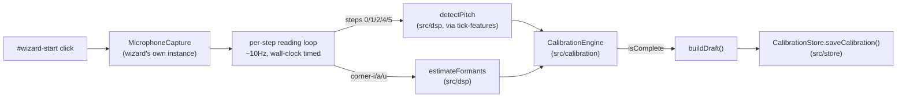

# Calibration wizard

Reference doc for `src/wizard.ts` — the DOM wiring that drives a real
calibration attempt through `src/calibration`'s `CalibrationEngine`.
For the protocol itself (what each step asks for and why), see
[calibration.md](./calibration.md). For the storage layer this saves
into, see [calibration-store.md](./calibration-store.md).

## Data flow

## Why a sibling module, not a growth of main.ts

`main.ts` was already ~200 lines wiring the v0.1/v0.2 instrument. This
feature roughly doubles that surface, so it lives in its own file,
`src/wizard.ts`, imported by `main.ts` rather than added to it —
avoids `main.ts` becoming a god module. Not under `src/calibration/`
either: that module's charter is headless (no DOM, no Web Audio, no
Canvas), and this is exactly DOM + Web Audio wiring. `main.ts` and
`wizard.ts` are where top-level composition lives — see
`docs/decisions.md`.

## Two-way coordination with the instrument

The instrument and the wizard both need exclusive use of the
microphone (`MicrophoneCapture.start()` throws if called while another
instance holds `"active"`/`"permission-requested"` state, and running
both at once would double-write to two different stores confusingly).
Neither module owns the other, so coordination is two small callbacks:
`main.ts` calls `initCalibrationWizard(onWizardActiveChange)` once at
startup and gets back a `WizardController.setInstrumentActive()` it
calls whenever the instrument's own state changes; `wizard.ts` calls
`onWizardActiveChange` whenever its own state changes. Each side
disables the other's start button while it's active.

## Step loop

Drives `STEP_ORDER`/`STEP_PROMPTS` (`src/calibration`) directly — no
hardcoded step list here. For each step: `beginStep(id)`, run a
wall-clock-timed (`setInterval`/`setTimeout`, not
`requestAnimationFrame`) reading-collection window at ~10Hz for that
step's `durationMs`, then `submitStep(readings)`. Wall-clock timing
matters because a backgrounded tab throttles `requestAnimationFrame`,
which would otherwise silently stretch a step's real duration.

Steps `0`/`1`/`2`/`4`/`5` collect `StepReading` (`detectPitch`, via the
shared `tick-features` helper); `corner-i`/`corner-a`/`corner-u`
collect `FormantStepReading` (`estimateFormants`). `estimateFormants`
throws on some malformed input rather than always returning `null` —
each tick's call is wrapped so one bad reading doesn't end the whole
step's collection loop early.

After a step's validity result appears, the user must tap **Next**
(or **Redo**, which calls `redoStep(id)` and restarts the same step
from scratch) before the wizard advances — it never auto-advances
immediately after showing a result, so there's always time to read the
message or hit redo. Cancelling at any point (`#wizard-cancel`) aborts
the in-progress step's collection loop and any pending "waiting for
Next/Redo" state via an `AbortController`, stops the microphone, and
discards the `CalibrationEngine` instance — since `buildDraft()` only
ever runs after every step succeeds, nothing partial is ever saved.

On completion, the wizard shows a plain, descriptive message — what
was captured and which steps (by number, not a score) didn't get a
clean reading — never a grade or verdict (CLAUDE.md non-negotiable).

## Known gap: raw frames aren't persisted yet

`saveCalibration(draft, new Map())` is called with a deliberately empty
raw-readings map. A dependent follow-up issue wires
`CalibrationEngine.getStepReadings()` through for real — see
[calibration-store.md](./calibration-store.md)'s "Known gaps".

## Testing

`e2e/calibration-wizard.spec.ts` drives a full 8-step attempt against
a real headless Chromium with a fake audio input device (same
synthetic-mic approach as `session-lifecycle.spec.ts`) and asserts a
`Calibration` record exists afterward with the expected shape — not
specific frequency values, since the fake device isn't real speech
(same documented limitation `testing.md` already states for the
instrument's own e2e coverage). Also covers: cancelling mid-wizard
discards state and re-enables the instrument; starting either the
instrument or the wizard disables the other's start control. The
step loop's real-time durations sum to ~29 seconds, so this spec needs
a longer-than-default test timeout.
