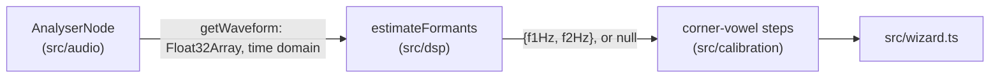
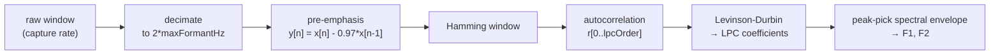

# Formant extraction

Reference doc for `estimateFormants` in `src/dsp/index.ts`. Consumed
by the corner-vowel step engine (`src/calibration/index.ts`'s
`corner-i`/`corner-a`/`corner-u` steps), which `src/wizard.ts` now
drives from real microphone capture — see
[calibration.md](./calibration.md),
[calibration-store.md](./calibration-store.md), and
[calibration-wizard.md](./calibration-wizard.md).

## Data flow

Same input source as `detectPitch` — `getWaveform()`'s time-domain
buffer, not a second capture path.

## Algorithm

Linear predictive coding (LPC), in five stages:

**Decimation.** Running LPC directly at a raw 44.1k/48k capture rate
would need a much higher predictor order to span that bandwidth, most
of which is irrelevant to F1/F2 — and a higher order makes the
resulting spectral envelope wigglier and more prone to spurious
peaks. `estimateFormants` decimates by an **integer factor** toward
`2 * maxFormantHz` (10kHz at the default `maxFormantHz` of 5000Hz)
before doing anything else, mirroring standard formant-analysis
practice (e.g. Praat resamples toward twice its "maximum formant"
parameter for the same reason). Because the factor is an integer
(`floor(sampleRate / targetRateHz)`), the resulting working rate only
*approaches* the target, and varies by capture rate — 44.1kHz and
48kHz both decimate by 4, landing at 11025Hz and 12000Hz respectively
(close, not identical), and a capture rate at or below the target
(e.g. a 16kHz mic) isn't decimated at all, keeping its own rate
outright. `lpcOrder` therefore scales with the **actual working
rate** (`round(workingRate / 1000) + 4`, unless overridden) rather
than being a fixed constant — this is what keeps accuracy comparable
across capture rates in practice, not a claim that decimation makes
every rate literally equivalent. (An earlier version of this function
used a single hardcoded default order and claimed the working rate
was rate-independent; both were wrong, caught by an independent
numerics audit before merge — see "Testing" below for the real
per-rate accuracy figures.) The decimation filter itself is a
windowed-sinc (Hamming-windowed) lowpass FIR, applied before
subsampling to anti-alias; it's a no-op (beyond a type conversion)
when the input is already at or below the target rate.

**Pre-emphasis** (`y[n] = x[n] - 0.97*x[n-1]`) flattens voiced
speech's natural -6dB/octave spectral tilt, so LPC spends its poles
modeling actual vocal-tract resonances rather than mostly re-deriving
the tilt. 0.97 is the standard value used throughout the LPC
literature, not tuned against this project's own data.

**Windowing** is a plain Hamming window over the (decimated,
pre-emphasized) frame before autocorrelation.

**Levinson-Durbin** solves the normal equations for the LPC
coefficients in O(order²) rather than O(order³) for a direct matrix
solve. Returns `null` if a reflection coefficient's magnitude reaches
or exceeds 1 at any step — an ill-conditioned or fundamentally
non-predictable signal (e.g. white noise), the same "never a
misleading number" contract `detectPitch` follows for its own
degenerate cases.

**Peak-picking**, not root-finding. The more precise way to extract
formants from an LPC model is to find the complex roots of the
all-pole denominator polynomial and read off each root's angle — but
that needs complex-polynomial root-finding, which this project doesn't
already have and didn't want to either write from scratch or pull in
as a new dependency (CLAUDE.md: ask before adding one). Instead,
`estimateFormants` evaluates `|H(e^jw)| = 1/|D(e^jw)|` on a fixed
frequency grid (5Hz steps) across `[minFormantHz, maxFormantHz]` and
takes local maxima, each refined to sub-grid precision via the same
parabolic-interpolation technique `detectPitch` already applies to its
own correlation peak.

**Prominence filtering.** Peak-picking alone isn't enough: LPC still
fits *some* all-pole model to any input, even pure noise or a single
sine tone, and the poles that aren't modeling a real resonance don't
just vanish — they produce weak numerical ripple in the envelope that
can still register as a local maximum. Each candidate peak is tagged
with its topographic prominence (peak height minus the higher of the
lowest points on either side before the envelope would rise again,
computed in dB), and anything below `minPeakProminenceDb` (default
3dB) is dropped before the two lowest-frequency survivors are reported
as F1/F2. Ascending-frequency peaks closer together than
`minPeakSeparationHz` (default 150Hz) are then collapsed to one,
keeping the first — treated as one ambiguous resonance the envelope
happened to split into two nearby local maxima, not two real formants.
**Known simplification**: this is prominence and separation only, not
the pole-bandwidth-based confidence a real formant tracker would also
weigh — acceptable for now, revisit if it produces bad results on real
recordings (see "Testing" below). `minPeakSeparationHz` is a safety
net for peaks the envelope resolved as two nearby local maxima, not a
fix for peaks it never resolved as two maxima at all: at the default
`lpcOrder`, two true resonances closer than roughly 150-300Hz apart
can show up as a *single* local maximum in the envelope, in which case
lowering `minPeakSeparationHz` does nothing — there's only one
candidate peak to begin with, not two close ones to un-collapse. A
higher `lpcOrder` can resolve them (confirmed in testing: order 20 vs
the ~15 the default formula picks at a typical working rate correctly
separated a synthetic 500Hz/620Hz pair), but raising the default
wasn't adopted here without re-validating the prominence-filter edge
cases (white noise, a pure tone) at that higher order, which is out of
this issue's scope. This matters concretely for the corner-vowel
calibration step this feeds into: back/rounded vowels like /u/ often
have F1/F2 closer together than front vowels, so a legitimate /u/
could plausibly return `null` indistinguishably from "no voice
detected" — flagged to whoever wires that step.

`minFormantHz`/`maxFormantHz` (default 150-5000Hz) bound the peak
search — the physically plausible F1/F2 range across adult speech in
general, not any specific person's target. Same category as
`detectPitch`'s `minFrequencyHz`/`maxFrequencyHz`: an algorithm
parameter, not one of the targets CLAUDE.md forbids hardcoding.

Returns `null` for: silence, an ill-conditioned Levinson-Durbin
result, or fewer than two sufficiently prominent and separated peaks
in range (which is also how unvoiced/noisy input that happens to be
numerically well-conditioned gets rejected, and how a pure tone with
only one real resonance is handled — see "Testing").

## Testing

`src/dsp/index.test.ts` covers: recovering three corner-vowel-like
F1/F2 pairs (`/i/`-, `/a/`-, `/u/`-like, using [Peterson & Barney
(1952)](https://doi.org/10.1121/1.1906875)-adjacent adult formant
values as fixture ground truth only, never surfaced as coaching
targets) from a synthetic source-filter vowel — a sawtooth excitation
through two cascaded resonant IIR filters — at both 44.1kHz and
48kHz; recovering the same at 16kHz (a capture rate below the
decimation trigger, exercising the undecimated code path); returning
`null` for silence, non-finite input (NaN/Infinity), deterministic
pseudo-random white noise (a real LPC fit exists, but its peaks don't
clear the prominence floor), and a pure sine tone (one real
resonance, no meaningful second formant); throwing for a window too
short for the chosen `lpcOrder` after decimation, and for invalid
option combinations.

As with `detectPitch`, these are synthetic self-consistency tests
against a hand-built source-filter model, not golden-file comparisons
against a trusted external oracle (Praat, a labeled corpus of real
vowel recordings) — the same lighter bar decisions.md's "Corrected"
entry already established for `computeLogFrequencyBins` and
`detectPitch`, applied here rather than building a full oracle-
comparison harness (that stays the separate, still-unstarted
"Golden-file DSP fixtures" backlog item). The synthetic resonator
model is a crude approximation of a real vocal tract — it produces
formant-shaped spectral peaks at the target frequencies, nothing more
— so passing these tests demonstrates the LPC/peak-picking pipeline
recovers formants from a signal that plausibly has them, not that it's
accurate on a real, messy recording. **This hasn't been validated
against real voice at all.**

### Known limitations (quantified, not glossed over)

An independent numerics audit of this PR (different F1/F2 pairs,
different excitation model, and harder edge cases than the committed
test suite — see the PR discussion) found the committed tests' own
tolerances (±40Hz F1 / ±60Hz F2) don't characterize the estimator's
real behavior outside the specific fixtures they use. Two real,
unresolved failure modes, both directly relevant to this app's actual
use case:

- **Harmonics-to-formant interaction gets worse, not better, at
  higher F0.** Peak-picking can lock onto a harmonic near the true
  resonance instead of the resonance itself, and the effect is
  *non-monotonic* — it depends on how the F0-spaced harmonic grid
  happens to sit relative to the true formant, not on F1 magnitude
  alone. The original version of this doc characterized the bias as
  "a few percent," based only on a single low F0 (150Hz) across three
  fixtures. Audit testing at F0 in the 220-350Hz range — squarely
  within plausible feminization-training targets — found F1 errors
  from roughly 12% up to over 25%, and in one case a wrong second
  peak entirely (F2 off by ~49%). This is a known, real limitation of
  naive peak-picked LPC at high F0 relative to formant bandwidth, not
  something this implementation does uniquely wrong.

  **Investigated for issue #46**: two accessible, no-new-dependency
  mitigations were prototyped and quantified against the same
  synthetic corner-vowel fixtures (`/i/`, `/a/`, `/u/`) at F0 = 150,
  220, 280, 350Hz, both at the committed tests' 0.5s window and at the
  realistic ~43ms window `capture.getWaveform()` actually provides in
  production (`fftSize` 2048 at 48kHz — the committed tests' 0.5s
  window is roughly 12× longer than any window this function is
  actually called with in `src/wizard.ts`, a mismatch tracked
  separately as issue #68 since it's a test-fixture-realism gap, not
  specific to the high-F0 question this investigation is about).

  - **Raising `lpcOrder`** (12 → 20 at the working rates tested): does
    **not** reliably help, and in several cases makes it much worse —
    e.g. `/i/` at F0=280Hz: F2 error goes from 2.3% (order ~15,
    default) to 71.6% (order 20); `/a/` at F0=350Hz: F1 goes from 4.3%
    to 51.2%. A higher order gives the envelope more poles to spend on
    resolving nearby harmonics as if they were real resonances — worse,
    not better, confirming the existing "Prominence filtering" section's
    warning above about raising the default order without
    re-validating edge cases.
  - **Pitch-synchronous windowing** (truncating the analysis window
    to the largest integer number of pitch periods before Hamming
    windowing, using the *true* F0 — the best case for this
    technique, not even a real F0 estimate): produced results
    statistically indistinguishable from the baseline at both window
    lengths tested. The harmonics-to-formant bias isn't primarily a
    windowing/spectral-leakage artifact here — Hamming windowing
    already suppresses leakage reasonably well — it's that at high F0
    the harmonic grid itself is too sparse near the resonance for
    peak-picking to distinguish "harmonic" from "resonance," regardless
    of how cleanly the window is cut.

  Neither candidate is adopted. A real fix needs a genuinely different
  approach — cepstral liftering (separating the smooth spectral
  envelope from the periodic harmonic structure directly) is the most
  promising documented technique, but needs an FFT this codebase
  doesn't have yet (autocorrelation here is computed directly in the
  time domain); complex-polynomial root-finding on the LPC denominator
  is the other documented option, already ruled out once for the same
  no-new-dependency reason peak-picking was chosen over it in the
  first place (see "Peak-picking, not root-finding" above). Tracked as
  a separate, properly-scoped backlog item — issue #67 — since
  implementing either technique is a meaningfully sized addition, not
  a small follow-up to this investigation.
- **Closely-spaced formants can resolve as a single peak and return
  `null`**, not a degraded-but-present estimate — see "Prominence
  filtering" above. Concretely relevant to /u/-like vowels in the
  corner-vowel calibration step this feeds into.

Real-recording validation, and both limitations above, are open
follow-ups, not settled by this PR.
