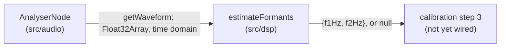
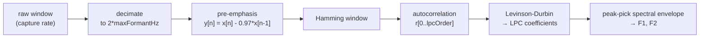

# Formant extraction

Reference doc for `estimateFormants` in `src/dsp/index.ts`. Not yet
wired into calibration's step engine — that's a separate follow-up
(the corner-vowel calibration step), tracked as its own issue,
dependent on this one. This function exists and is tested standalone
first.

## Data flow

Same input source as `detectPitch` — `getWaveform()`'s time-domain
buffer, not a second capture path.

## Algorithm

Linear predictive coding (LPC), in five stages:

**Decimation.** Running LPC directly at a raw 44.1k/48k capture rate
would need a much higher predictor order to span that bandwidth, most
of which is irrelevant to F1/F2 — and a higher order makes the
resulting spectral envelope wigglier and more prone to spurious
peaks. `estimateFormants` decimates to `2 * maxFormantHz` (10kHz at
the default `maxFormantHz` of 5000Hz) before doing anything else,
mirroring standard formant-analysis practice (e.g. Praat resamples to
twice its "maximum formant" parameter for the same reason). A
side-effect worth naming explicitly: this also means `lpcOrder`'s
default (12) is a **fixed** value tuned to the working rate, not the
raw capture rate — 44.1k and 48k captures produce the same working
rate after decimation, so the estimator behaves identically at either,
without needing to scale the order to the input rate at all. The
decimation filter itself is a windowed-sinc (Hamming-windowed) lowpass
FIR, applied before subsampling to anti-alias; it's a no-op (beyond a
type conversion) when the input is already at or below the target
rate, e.g. a low-rate synthetic test signal.

**Pre-emphasis** (`y[n] = x[n] - 0.97*x[n-1]`) flattens voiced
speech's natural -6dB/octave spectral tilt, so LPC spends its poles
modeling actual vocal-tract resonances rather than mostly re-deriving
the tilt. 0.97 is the standard value used throughout the LPC
literature, not tuned against this project's own data.

**Windowing** is a plain Hamming window over the (decimated,
pre-emphasized) frame before autocorrelation.

**Levinson-Durbin** solves the normal equations for the LPC
coefficients in O(order²) rather than O(order³) for a direct matrix
solve. Returns `null` if a reflection coefficient's magnitude reaches
or exceeds 1 at any step — an ill-conditioned or fundamentally
non-predictable signal (e.g. white noise), the same "never a
misleading number" contract `detectPitch` follows for its own
degenerate cases.

**Peak-picking**, not root-finding. The more precise way to extract
formants from an LPC model is to find the complex roots of the
all-pole denominator polynomial and read off each root's angle — but
that needs complex-polynomial root-finding, which this project doesn't
already have and didn't want to either write from scratch or pull in
as a new dependency (CLAUDE.md: ask before adding one). Instead,
`estimateFormants` evaluates `|H(e^jw)| = 1/|D(e^jw)|` on a fixed
frequency grid (5Hz steps) across `[minFormantHz, maxFormantHz]` and
takes local maxima, each refined to sub-grid precision via the same
parabolic-interpolation technique `detectPitch` already applies to its
own correlation peak.

**Prominence filtering.** Peak-picking alone isn't enough: LPC still
fits *some* all-pole model to any input, even pure noise or a single
sine tone, and the poles that aren't modeling a real resonance don't
just vanish — they produce weak numerical ripple in the envelope that
can still register as a local maximum. Each candidate peak is tagged
with its topographic prominence (peak height minus the higher of the
lowest points on either side before the envelope would rise again,
computed in dB), and anything below `minPeakProminenceDb` (default
3dB) is dropped before the two lowest-frequency survivors are reported
as F1/F2. Ascending-frequency peaks closer together than
`minPeakSeparationHz` (default 150Hz) are then collapsed to one,
keeping the first — treated as one ambiguous resonance the envelope
happened to split into two nearby local maxima, not two real formants.
**Known simplification**: this is prominence and separation only, not
the pole-bandwidth-based confidence a real formant tracker would also
weigh — acceptable for now, revisit if it produces bad results on real
recordings (see "Testing" below).

`minFormantHz`/`maxFormantHz` (default 150-5000Hz) bound the peak
search — the physically plausible F1/F2 range across adult speech in
general, not any specific person's target. Same category as
`detectPitch`'s `minFrequencyHz`/`maxFrequencyHz`: an algorithm
parameter, not one of the targets CLAUDE.md forbids hardcoding.

Returns `null` for: silence, an ill-conditioned Levinson-Durbin
result, or fewer than two sufficiently prominent and separated peaks
in range (which is also how unvoiced/noisy input that happens to be
numerically well-conditioned gets rejected, and how a pure tone with
only one real resonance is handled — see "Testing").

## Testing

`src/dsp/index.test.ts` covers: recovering three corner-vowel-like
F1/F2 pairs (`/i/`-, `/a/`-, `/u/`-like, using [Peterson & Barney
(1952)](https://doi.org/10.1121/1.1906875)-adjacent adult formant
values as fixture ground truth only, never surfaced as coaching
targets) from a synthetic source-filter vowel — a sawtooth excitation
through two cascaded resonant IIR filters — at both 44.1kHz and 48kHz
to confirm decimation makes the result sample-rate-independent;
silence → null; deterministic pseudo-random white noise → null (a
real LPC fit exists, but its peaks don't clear the prominence floor);
a pure sine tone → null (one real resonance, no meaningful second
formant); a window too short for the chosen `lpcOrder` after
decimation → throws; and invalid option combinations → throws.

As with `detectPitch`, these are synthetic self-consistency tests
against a hand-built source-filter model, not golden-file comparisons
against a trusted external oracle (Praat, a labeled corpus of real
vowel recordings) — the same lighter bar decisions.md's "Corrected"
entry already established for `computeLogFrequencyBins` and
`detectPitch`, applied here rather than building a full oracle-
comparison harness (that stays the separate, still-unstarted
"Golden-file DSP fixtures" backlog item). The synthetic resonator
model is a crude approximation of a real vocal tract — it produces
formant-shaped spectral peaks at the target frequencies, nothing more
— so passing these tests demonstrates the LPC/peak-picking pipeline
recovers formants from a signal that plausibly has them, not that it's
accurate on a real, messy recording (harmonics-to-formant interaction,
breathiness, mic-response coloration, a vocal tract that isn't a
cascade of two ideal resonators). **This hasn't been validated against
real voice at all.** Real-recording validation, and the small-but-real
systematic bias visible even against the synthetic fixtures (a few
percent, consistent between the two tested sample rates) are open
follow-ups, not settled here.
