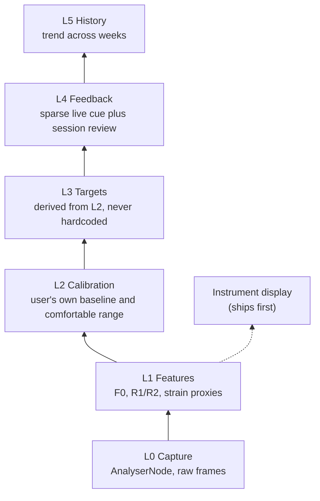

# Resonance Scope

Resonance Scope is a browser-based voice analysis and training tool
for vocal feminization. It is instrument first — a real-time
spectrogram and pitch readout in the spirit of Overtone Analyzer,
VoceVista Video Pro, and Voice Tools — but adds the memory, personal
calibration, and progressive coaching those tools lack. Everything
runs client-side: audio never leaves the browser.

## Contents

- [Roadmap](./roadmap.md) — versions and scope, effort-sized not date-sized
- [Decisions](./decisions.md) — running decision ledger
- [Calibration](./calibration.md) — the 6-step calibration protocol
- [Strain](./strain.md) — the StrainEstimator interface and risk tiers
- [Backlog](./backlog.md) — parked ideas
- [Documentation standards](./documentation-standards.md) — how these docs are written
- [Audio capture](./audio-capture.md) — mic capture module: API, audio graph, state machine
- [Spectrogram](./spectrogram.md) — log-frequency bin remapping and the scrolling canvas renderer
- [Pitch detection](./pitch-detection.md) — the autocorrelation-based F0 estimator
- [Session store](./session-store.md) — IndexedDB schema and the SessionStore API
- [ADR 0001: Client-side only](./adr/0001-client-side-only.md) — architecture decision record
- [ADR 0002: Raw getUserMedia constraints (AGC off)](./adr/0002-agc-off-raw-constraints.md) — architecture decision record
- [ADR 0003: Session persistence schema](./adr/0003-session-persistence-schema.md) — architecture decision record

## Layer model

Data flows up through layers of increasing interpretation. Each layer
only depends on the ones below it.

L1 also branches directly to the instrument display, which ships in
v0.1 with no calibration behind it. **Gate: L3 and L4 do not get built
until L2 exists.** Targets and feedback derived from an absent
calibration would have to fall back to hardcoded numbers, which
CLAUDE.md forbids outright.
