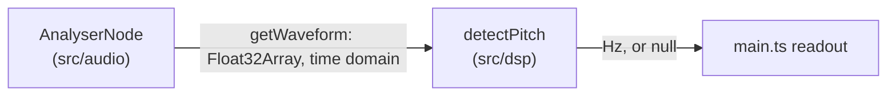

# Pitch detection

Reference doc for `detectPitch` in `src/dsp/index.ts` and the
`getWaveform()` method it consumes on `MicrophoneCapture`
(`src/audio/index.ts`).

## Data flow

`getWaveform()` reads the same `AnalyserNode` used for the spectrogram
(`getFloatTimeDomainData` instead of `getFloatFrequencyData`), sized to
`fftSize` samples rather than `frequencyBinCount` — no second analyser
node needed.

## Algorithm

Normalized autocorrelation (NSDF, as used in the McLeod Pitch Method):
for each candidate lag, `2 * correlation(lag) / (energy of that lag's
own overlap window)`, rather than dividing by the whole window's
energy. The overlap-window normalization matters — dividing by a fixed
whole-window energy instead systematically penalizes larger lags
(lower frequencies) as the overlapping region shrinks, which was
caught by this project's own sine-wave unit test before it shipped
(see `src/dsp/index.test.ts`).

Candidate lag selection walks from the smallest lag (highest
frequency) upward and takes the **first local maximum** that clears
`clarityThreshold` (default 0.9), not the global maximum across the
whole search range. A periodic signal correlates strongly at every
integer multiple of its true period, so a naive global-max search can
lock onto twice the true period — half the true frequency, the classic
"octave error." This was also caught by the sine-wave test (the naive
version returned 55Hz for a 110Hz input) before being fixed.

Sub-sample precision comes from a parabolic fit around the chosen
peak's three neighboring NSDF values.

`minFrequencyHz`/`maxFrequencyHz` (default 50-1000Hz) bound the lag
search range — the physically plausible fundamental-frequency range
for a human voice in general, not any specific person's target. This
is the same category as `computeLogFrequencyBins`'s `minFrequencyHz`
(see [spectrogram.md](./spectrogram.md)): an algorithm parameter, not
one of the targets CLAUDE.md forbids hardcoding.

Returns `null` — never a misleading number — for silence, unvoiced/
noisy input below `clarityThreshold`, or a window too short to contain
even the longest lag the frequency range requires.

## Testing

`src/dsp/index.test.ts` covers: recovering 110/220/440Hz from
synthetic sine waves within 1Hz, silence → null, deterministic
pseudo-random noise → null, a too-short window → null, and invalid
option combinations → throws. As with `computeLogFrequencyBins`, these
are synthetic self-consistency tests, not golden-file comparisons
against a trusted external oracle (Praat, librosa) — see
[spectrogram.md](./spectrogram.md#testing) for why that's out of scope
right now. Real voice is messier than a clean sine wave (harmonics,
jitter, breathiness) — this hasn't been validated against a real
recording, only synthetic signals.
