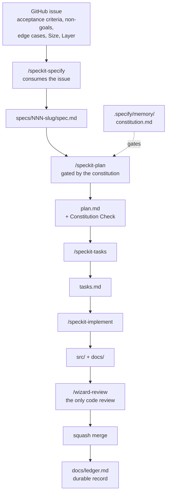

# Spec-driven development

How-to doc: running a change through [GitHub Spec
Kit](https://github.com/github/spec-kit) in this repo, and the rules
that bind it to the board, the constitution, and the docs tree.

For *why* this was adopted and what was rejected, see
[ADR 0005](./adr/0005-spec-driven-development-with-spec-kit.md).

## When to use it

Use the loop for any change that adds or alters product capability.

Skip it for:

- **One-off edits** already carved out in [CLAUDE.md](../CLAUDE.md)'s
  Tracking rules — typo/copy fixes, a config value, a version bump.
- **Investigation spikes** where the outcome is unknown. There is no
  spec to write until you know the answer; issues [#67](https://github.com/lvndrpup/voice-trainer/issues/67)
  and [#75](https://github.com/lvndrpup/voice-trainer/issues/75) are
  this shape. Write a spec afterwards if the spike turns into work.

## The pipeline



The board still owns status. Spec Kit owns the middle — the plan and
task decomposition this project previously had no tooling for.

## Handoff: from a board issue into a spec

`/speckit-specify` **consumes** the issue; it does not re-derive it.
Issues here are already spec-shaped (Summary, Acceptance criteria,
Non-goals, Edge cases / failure modes, Layer, Size), so paste or
reference the issue body rather than restating the feature from
scratch.

The board fields the retired `groomer` agent used to enforce are now
this step's responsibility. Before running `/speckit-specify`, confirm
the issue has:

- Acceptance criteria as independently verifiable checkboxes
- **Size** — XS (<1h), S (1-3h), M (3-8h), L (too big; split it)
- **Layer** — from the module boundaries in [CLAUDE.md](../CLAUDE.md)
- A milestone
- Explicit non-goals, to stop scope creep at implementation time

An issue missing any of these is not Ready, and the spec written from
it will inherit the gap.

## Running the loop

```bash
# 1. Expand the issue into a spec
/speckit-specify   # paste the issue body / reference the issue

# 2. Optional: de-risk ambiguity before planning
/speckit-clarify   # up to 5 targeted questions, answers written back

# 3. Architectural plan, checked against the constitution
/speckit-plan

# 4. Dependency-ordered task list
/speckit-tasks

# 5. Optional: cross-artifact consistency check
/speckit-analyze   # NOT a code review — see below

# 6. Execute
/speckit-implement
```

Artifacts land in `specs/<NNN-slug>/`. The numbering is sequential and
derived from existing directories under `specs/` — **not** from the
branch name, and not from the issue number.

Spec Kit does not create git branches. `create-new-feature.sh` only
writes the spec directory; branch creation lives in an optional
extension this project does not install. Branch naming stays
`feat/`/`fix/`/`docs/`/`chore/` + short-kebab, per
[CLAUDE.md](../CLAUDE.md).

### Worked example

[`specs/001-noise-floor-brightness/`](../specs/001-noise-floor-brightness/)
is a real run of steps 1, 3 and 4 against issue
[#64](https://github.com/lvndrpup/voice-trainer/issues/64). Read it to
see what the artifacts actually look like before running your own.

It is **retrospective**: #64 was already implemented in
[PR #73](https://github.com/lvndrpup/voice-trainer/pull/73) before the
spec was written. That tree is a demonstration of the loop, not
outstanding work, and its tasks are deliberately left unchecked. Where
its `research.md` reaches a different conclusion than #73 did, that is
a documented difference of judgment on an explicit trade-off — read it
as an example of how the artifacts record reasoning, not as guidance
for the noise-floor work.

The useful thing to study in it is `plan.md`'s **Constitution Check**:
it shows the gate doing real work rather than rubber-stamping —
principle III needed an explicit argument that a display constant is
not a hardcoded frequency target, and principle VII forced a
documentation task into the task list.

## The constitution

`.specify/memory/constitution.md` is the gate `/speckit-plan` checks
every plan against, and it is written as a full standalone document
rather than a pointer back to [CLAUDE.md](../CLAUDE.md). Anything not
in it is not gated.

Its Governance section carries the ownership rule that keeps the two
files from drifting:

| File | Owns | Loaded |
|---|---|---|
| `.specify/memory/constitution.md` | Rules checkable against a plan or spec | When a `/speckit-*` skill consults it |
| [`CLAUDE.md`](../CLAUDE.md) | Session, git, and board process | Automatically, every session |

Where both mention a rule, the constitution carries the plan-checkable
statement and CLAUDE.md the operational one. A conflict between them is
a bug to fix in one of them — never something to reinterpret at plan
time to make a plan pass.

After running `/speckit-plan`, read the generated **Constitution
Check** section. If it is empty or generic, the constitution is not
doing its job.

## Where artifacts live

`specs/` and `docs/` are not the same kind of record, and the
distinction matters because [CLAUDE.md](../CLAUDE.md)'s "Docs vs.
specs" rule turns on it.

- **`specs/<NNN-slug>/`** — pre-merge working artifacts for one
  feature: `spec.md`, `plan.md`, `tasks.md`, and any research or
  data-model files the plan phase produces. These describe *intent*,
  the same way [roadmap.md](./roadmap.md) and
  [decisions.md](./decisions.md) do. A merged spec is not evidence
  that the thing works.
- **`docs/`** — durable reference, written or updated in the same
  commit as the code it describes. Reference docs, the ADRs, and
  [ledger.md](./ledger.md) remain the ground truth for what actually
  shipped.

A spec does not replace the reference doc for the module it touches.
Docs-are-part-of-done still applies: `/speckit-tasks` output that
contains no documentation task is incomplete, and the constitution
gates on this.

## Fenced-off commands

Two of the ten installed skills are not used here.

**`/speckit-taskstoissues` — never run it.** It converts a task list
into GitHub issues, which drives straight through the board's
WIP-limit-1 and Ready-cap-5 rules. That flow control is deliberate.
Tasks live in `tasks.md`; the board tracks issues, not tasks.

**`/speckit-analyze` is not code review.** Its skill definition
declares it `STRICTLY READ-ONLY` over "the three core artifacts
(`spec.md`, `plan.md`, `tasks.md`)" and it never opens a source file.
It checks the plan against itself, not the code against the plan. It
is useful before implementing; it is not a substitute for
`/wizard-review` or the `reviewer` agent.

**Spec Kit ships no code-review capability at all.** That is the single
most important thing to know about its scope, and the reason the
`wizard-*` bench survived this adoption while `groomer` did not.

## Cost

Spec Kit is a rigor upgrade, not a token saving. Measured at adoption:

| | words |
|---|---|
| Spec Kit's 10 skills | 18,477 |
| All 14 pre-existing agent + skill definitions | 4,701 |
| `/speckit-checklist` alone | 2,993 |
| All five `wizard-*` agents combined | 2,000 |

Skill bodies load only when invoked, in both systems, so this is
per-invocation cost rather than constant overhead. But the loop also
produces a `spec.md` + `plan.md` + `tasks.md` tree that later phases
re-read. Budget accordingly, and prefer the optional steps
(`/speckit-clarify`, `/speckit-analyze`, `/speckit-checklist`) only
when a change genuinely warrants them.

## Upgrading

Reinstall pinned, from the repo root:

```bash
uvx --from git+https://github.com/github/spec-kit.git@vX.Y.Z \
  specify init --here --force --non-interactive \
  --ignore-agent-tools --integration claude
```

Two things to know before you do:

- It rewrites `.claude/settings.json`, re-serializing the JSON and
  ASCII-escaping non-ASCII characters — the ellipsis in the
  `check-test-plan.sh` hook's `statusMessage` comes back as a
  `\u2026` escape. Semantically identical JSON, but it shows up as a
  diff. Revert it unless you actually changed settings.
- It does **not** touch [CLAUDE.md](../CLAUDE.md) and does not modify
  existing agents or skills — it only adds `.claude/skills/speckit-*`
  and `.specify/`. Verify with `git status` rather than assuming.

Pin the version. The 1.0 API is new, and the invocation style changed
from `speckit.x` to `speckit-x` shortly before this project adopted it.

`.specify/.gitignore` ships correctly configured — it ignores
`feature.json` (per-checkout state) and extension local config. The
rest of `.specify/`, and all of `specs/`, is committed.
