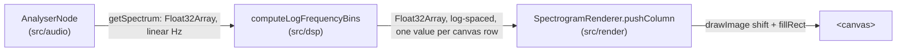

# Spectrogram

Reference doc for the log-frequency scrolling spectrogram: the
`computeLogFrequencyBins` function in `src/dsp/index.ts` and the
`SpectrogramRenderer` class in `src/render/index.ts`.

## Data flow



`main.ts` is the only place that touches all three layers — `src/dsp`
and `src/render` don't import each other or `src/audio`, per the
module boundaries in [CLAUDE.md](../CLAUDE.md).

## Why log-frequency, not linear

Every reference instrument this project takes as prior art (Overtone
Analyzer, VoceVista, Voice Tools) displays frequency on a log axis:
equal pixel distances represent equal frequency *ratios*, not equal Hz.
Pitch and formant spacing are logarithmic — an octave is always a 2×
ratio regardless of register — so a linear axis compresses the entire
low end (where most fundamental frequency and first-formant activity
happens) into a sliver of the display. [likely — this is standard
practice across every spectrogram tool surveyed for this project, not
independently benchmarked here]

## `computeLogFrequencyBins`

```typescript
function computeLogFrequencyBins(
  magnitudesDb: Float32Array,
  sampleRate: number,
  outputBinCount: number,
  options?: { minFrequencyHz?: number },
): Float32Array
```

Takes a linear-frequency magnitude array (as returned by
`AnalyserNode.getFloatFrequencyData`), remaps it onto `outputBinCount`
log-spaced buckets between `minFrequencyHz` (default 20Hz) and the
Nyquist frequency (`sampleRate / 2`), via linear interpolation between
the two nearest linear bins.

`minFrequencyHz` is a **display-axis bound**, not a coaching target —
it doesn't tell the user what to aim for, only where the log axis
starts. This is the same category as `fftSize` or `minDecibels`: an
implementation parameter, not one of the frequency/formant targets
CLAUDE.md forbids hardcoding.

The axis currently runs 20Hz to Nyquist — there is no upper cap. A
60Hz-8kHz range was specified for this display during GitHub issue #2's
grooming and was never reconciled with the shipped default; see
[decisions.md](./decisions.md#open) for the open question.

Throws on: fewer than 2 input bins, a non-positive-integer
`outputBinCount`, or a `minFrequencyHz` outside `(0, nyquist)`. Tested
with synthetic inputs in `src/dsp/index.test.ts` (constant-input,
monotonic-ramp, and boundary-rejection cases) — see "Testing" below.

## `SpectrogramRenderer`

Draws one column per `pushColumn()` call at the canvas's right edge,
low frequency at the bottom, then shifts existing content one pixel
left via `ctx.drawImage(canvas, -1, 0)` rather than redrawing history
each frame. `pushColumn()` expects its input to already be remapped to
exactly `canvas.height` values — the renderer only draws pixels, it
has no notion of frequency.

Magnitude-to-brightness mapping is grayscale, linear between
`minDb`/`maxDb` (defaults -100/-30, matching the analyser's own
defaults). No colormap dependency, kept intentionally simple for a
first-pass instrument display — revisit if a warmer/perceptual
colormap turns out to matter once there's something to look at.

Any pixel `pushColumn()` actually draws gets a `MIN_DRAWN_LEVEL` (24 of
255) brightness floor, even at or below `minDb` — without it, intensity
clamped to 0 at the noise floor and `clear()`'s solid-black fill were
the same `rgb(0,0,0)`, so "quiet signal, correctly captured" and
"nothing drawn here yet" were visually indistinguishable (issue #64).
The floor only raises the low end of the clamp; `maxDb` still maps to
255 and the rest of the intensity range is unrescaled, so above-floor
signal keeps its existing contrast — genuinely quiet-but-above-`minDb`
signal whose natural level would fall under 24 also gets pulled up to
the same floor a literally-at-`minDb` pixel gets, which is the
accepted tradeoff of any floor scheme, not a bug. 24 is a reasonable
low value chosen to be visibly distinct from pure black without
reading as real mid-range signal, not a perceptually measured
threshold.

## Accessibility

Surfaced by dogfooding the `accessibility-tester` subagent against the
real UI (issue #38): `#peak-db` and `#f0-hz` (`index.html`) were plain
`<span>`s updated via `textContent` on every ~60Hz `requestAnimationFrame`
tick in `main.ts`'s `tick()`, with no live region — a screen reader had
no way to know these values were changing at all.

The first fix attempt just added `role="status"` to their wrapping
`<p>` elements and throttled the write to ~10Hz (this project's usual
UI-update cadence, see [session-store.md](./session-store.md)). A
second audit pass against that fix caught a real remaining problem:
`role="status"` implies `aria-live="polite"`, which *queues*
announcements rather than dropping superseded ones — even at 10Hz that
queues 10-20 announcements/second (both regions combined) faster than
speech can keep up, backing up into an unstoppable stream a
screen-reader user can't outrun.

The actual fix decouples the two rates. `#peak-db`/`#f0-hz` are plain
visual spans again (no live region, no `role="status"`) — a sighted
user just watches them refresh continuously, which needs no
announcement throttling at all. A separate element,
`#readout-announcement`, is the only live region: visually hidden
(clip-based, not `display:none`, so it stays in the accessibility tree)
and updated at a much coarser `READOUT_ANNOUNCE_INTERVAL_MS` (1000ms),
combining both values into one announcement ("Peak -20.3 dB, F0 180.2
Hz") rather than two separate regions firing independently.

`#spectrogram` also gained an `aria-label` describing what it shows —
it previously had no accessible name or fallback content at all.

The same audit pass found three further gaps left open, filed
separately rather than folded into this fix (out of scope for issue
#38, which was scoped to the readouts and the canvas label):
keyboard focus being dropped to `<body>` on every start/delete/export
action because the just-activated button gets disabled without a
restore-focus call (issue #63, fix pending merge); below-noise-floor
signal rendering identically to the blank canvas background (issue
#64 — **fixed**, see "Magnitude-to-brightness mapping" above); and the
grayscale mapping's earlier colorblind sign-off checking
hue-independence but not perceptual linearity, so quiet-end contrast
may be compressed relative to sRGB's actual response curve (issue #65,
still open)
[likely — not independently measured with a contrast-analysis tool].

## Testing

`src/dsp/index.test.ts` runs under Node's built-in test runner
(`node --test`, wired up as `npm test`) — no test framework dependency
added. This is the "golden-file test harness lands before custom DSP"
commitment from `decisions.md`, but scoped honestly: these are
synthetic self-consistency tests (constant input → constant output,
a monotonic ramp → correctly-ordered output, invalid input → throws),
not golden-file comparisons against a trusted external oracle (e.g.
Praat, librosa). Building that oracle comparison would need an
external reference tool as a dependency, which is out of scope here.
`src/render/index.ts` has no automated tests — it's Canvas/DOM-bound
and can't run headlessly, the same gap `src/audio` has (see
[audio-capture.md](./audio-capture.md)'s Known gaps).
