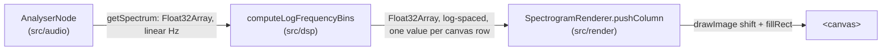

# Spectrogram

Reference doc for the log-frequency scrolling spectrogram: the
`computeLogFrequencyBins` function in `src/dsp/index.ts` and the
`SpectrogramRenderer` class in `src/render/index.ts`.

## Data flow



`main.ts` is the only place that touches all three layers — `src/dsp`
and `src/render` don't import each other or `src/audio`, per the
module boundaries in [CLAUDE.md](../CLAUDE.md).

## Why log-frequency, not linear

Every reference instrument this project takes as prior art (Overtone
Analyzer, VoceVista, Voice Tools) displays frequency on a log axis:
equal pixel distances represent equal frequency *ratios*, not equal Hz.
Pitch and formant spacing are logarithmic — an octave is always a 2×
ratio regardless of register — so a linear axis compresses the entire
low end (where most fundamental frequency and first-formant activity
happens) into a sliver of the display. [likely — this is standard
practice across every spectrogram tool surveyed for this project, not
independently benchmarked here]

## `computeLogFrequencyBins`

```typescript
function computeLogFrequencyBins(
  magnitudesDb: Float32Array,
  sampleRate: number,
  outputBinCount: number,
  options?: { minFrequencyHz?: number },
): Float32Array
```

Takes a linear-frequency magnitude array (as returned by
`AnalyserNode.getFloatFrequencyData`), remaps it onto `outputBinCount`
log-spaced buckets between `minFrequencyHz` (default 20Hz) and the
Nyquist frequency (`sampleRate / 2`), via linear interpolation between
the two nearest linear bins.

`minFrequencyHz` is a **display-axis bound**, not a coaching target —
it doesn't tell the user what to aim for, only where the log axis
starts. This is the same category as `fftSize` or `minDecibels`: an
implementation parameter, not one of the frequency/formant targets
CLAUDE.md forbids hardcoding.

Throws on: fewer than 2 input bins, a non-positive-integer
`outputBinCount`, or a `minFrequencyHz` outside `(0, nyquist)`. Tested
with synthetic inputs in `src/dsp/index.test.ts` (constant-input,
monotonic-ramp, and boundary-rejection cases) — see "Testing" below.

## `SpectrogramRenderer`

Draws one column per `pushColumn()` call at the canvas's right edge,
low frequency at the bottom, then shifts existing content one pixel
left via `ctx.drawImage(canvas, -1, 0)` rather than redrawing history
each frame. `pushColumn()` expects its input to already be remapped to
exactly `canvas.height` values — the renderer only draws pixels, it
has no notion of frequency.

Magnitude-to-brightness mapping is grayscale, linear between
`minDb`/`maxDb` (defaults -100/-30, matching the analyser's own
defaults). No colormap dependency, kept intentionally simple for a
first-pass instrument display — revisit if a warmer/perceptual
colormap turns out to matter once there's something to look at.

## Testing

`src/dsp/index.test.ts` runs under Node's built-in test runner
(`node --test`, wired up as `npm test`) — no test framework dependency
added. This is the "golden-file test harness lands before custom DSP"
commitment from `decisions.md`, but scoped honestly: these are
synthetic self-consistency tests (constant input → constant output,
a monotonic ramp → correctly-ordered output, invalid input → throws),
not golden-file comparisons against a trusted external oracle (e.g.
Praat, librosa). Building that oracle comparison would need an
external reference tool as a dependency, which is out of scope here.
`src/render/index.ts` has no automated tests — it's Canvas/DOM-bound
and can't run headlessly, the same gap `src/audio` has (see
[audio-capture.md](./audio-capture.md)'s Known gaps).
